# Technical Architecture Document
# Miro-to-Stories Framework

**Version:** 1.0  
**Status:** Approved  
**Created:** December 19, 2024  
**Author:** Winston (Solution Architect Agent)

---

## Table of Contents

1. [Architecture Overview](#1-architecture-overview)
2. [System Diagrams](#2-system-diagrams)
3. [Technology Stack](#3-technology-stack)
4. [Component Design](#4-component-design)
5. [Data Models](#5-data-models)
6. [API Design](#6-api-design)
7. [AI Agent Pipeline](#7-ai-agent-pipeline)
8. [Security & Error Handling](#8-security--error-handling)
9. [Development Guidelines](#9-development-guidelines)

---

## 1. Architecture Overview

### 1.1 System Summary

The Miro-to-Stories Framework is a lightweight web application that bridges Miro brainstorming boards with structured Jira-ready outputs through AI-powered analysis.

**Architecture Style:** Monolithic with modular internal structure (appropriate for MVP)

**Key Characteristics:**
- Single deployable unit (Next.js full-stack)
- Stateless design (no database for MVP)
- External service integration (MCP, AI APIs)
- Real-time processing pipeline

### 1.2 Design Principles

| Principle | Application |
|-----------|-------------|
| **Simplicity First** | Single Next.js app, no microservices |
| **Pragmatic Choices** | Proven technologies, minimal custom code |
| **Fail Fast** | Clear error messages, graceful degradation |
| **Stateless** | No persistence layer for MVP |
| **Modular Internals** | Clean separation despite monolith |

### 1.3 High-Level Architecture

```
┌─────────────────────────────────────────────────────────────────┐
│                         CLIENT BROWSER                          │
│  ┌─────────────────────────────────────────────────────────┐   │
│  │                 Next.js Frontend (React)                 │   │
│  │  • Board Selector  • Results Display  • Export Controls │   │
│  └─────────────────────────────────────────────────────────┘   │
└─────────────────────────────────────────────────────────────────┘
                                │
                                ▼
┌─────────────────────────────────────────────────────────────────┐
│                    NEXT.JS API ROUTES                           │
│  ┌─────────────────────────────────────────────────────────┐   │
│  │  /api/boards      │  /api/process      │  /api/health   │   │
│  └─────────────────────────────────────────────────────────┘   │
│                                │                                │
│  ┌─────────────────────────────────────────────────────────┐   │
│  │                    ORCHESTRATOR                          │   │
│  │  ┌───────────┐  ┌───────────┐  ┌───────────────────┐    │   │
│  │  │MCP Client │  │AI Agents  │  │ Output Generator  │    │   │
│  │  └───────────┘  └───────────┘  └───────────────────┘    │   │
│  └─────────────────────────────────────────────────────────┘   │
└─────────────────────────────────────────────────────────────────┘
                                │
                ┌───────────────┼───────────────┐
                ▼               ▼               ▼
        ┌───────────┐   ┌───────────┐   ┌───────────┐
        │MCP Server │   │ OpenAI/   │   │   Miro    │
        │(localhost)│   │ Claude    │   │   API     │
        └───────────┘   └───────────┘   └───────────┘
```

---

## 2. System Diagrams

### 2.1 Component Architecture


### 2.2 Data Flow Sequence

```mermaid
sequenceDiagram
    participant U as 👤 User
    participant FE as 🖥️ Frontend
    participant API as 🔌 API
    participant MCP as 🔗 MCP Server
    participant MIRO as 🎨 Miro
    participant AN as 📊 Analyst
    participant PM as 📋 PM Agent
    participant AI as 🤖 AI API

    U->>FE: Open Application
    FE->>API: GET /api/boards
    API->>MCP: List Boards
    MCP->>MIRO: Fetch Board List
    MIRO-->>MCP: Board List
    MCP-->>API: Board Data
    API-->>FE: Available Boards
    FE-->>U: Display Boards

    U->>FE: Select Board & Click Process
    FE->>API: POST /api/process/{boardId}
    
    API->>MCP: Get Board Content
    MCP->>MIRO: Read Stickies & Frames
    MIRO-->>MCP: Board Content
    MCP-->>API: Extracted Text

    API->>AN: Analyze Content
    AN->>AI: Summarize & Extract Insights
    AI-->>AN: Analysis Results
    AN-->>API: Discovery Summary

    API->>PM: Generate Stories
    PM->>AI: Create Epics & Stories
    AI-->>PM: Structured Output
    PM-->>API: Epics, Stories, Risks

    API-->>FE: Complete Results JSON
    FE-->>U: Display Results

    U->>FE: Click Copy/Download
    FE-->>U: JSON to Clipboard/File
```



### 2.3 Agent Processing Pipeline

```mermaid
flowchart LR
    subgraph Input["Input"]
        BOARD["📋 Miro Board\nContent"]
    end

    subgraph Pipeline["AI Processing Pipeline"]
        direction TB
        EXTRACT["1️⃣ Extract\nNormalize text from\nstickies & frames"]
        ANALYZE["2️⃣ Analyze\nIdentify themes,\ninsights, problems"]
        STRUCTURE["3️⃣ Structure\nCreate epics,\nstories, ACs"]
        ASSESS["4️⃣ Assess\nRisks, assumptions,\nquestions"]
    end

    subgraph Output["Output"]
        JSON["📄 Structured\nJSON"]
    end

    BOARD --> EXTRACT
    EXTRACT --> ANALYZE
    ANALYZE --> STRUCTURE
    STRUCTURE --> ASSESS
    ASSESS --> JSON

    style Input fill:#fef3c7,stroke:#d97706
    style Pipeline fill:#dbeafe,stroke:#2563eb
    style Output fill:#dcfce7,stroke:#16a34a
```



---

## 3. Technology Stack

### 3.1 Stack Overview

| Layer | Technology | Rationale |
|-------|------------|-----------|
| **Frontend** | Next.js 14 + React 18 | Full-stack framework, fast setup |
| **Styling** | Tailwind CSS + shadcn/ui | Rapid UI development |
| **API** | Next.js API Routes | Co-located with frontend |
| **AI Integration** | Vercel AI SDK | Streaming, provider abstraction |
| **MCP Client** | @modelcontextprotocol/sdk | Official MCP integration |
| **Validation** | Zod | Runtime type safety |
| **Language** | TypeScript | Type safety throughout |

### 3.2 Detailed Stack

#### Frontend

```typescript
// Core Dependencies
{
  "next": "^14.0.0",
  "react": "^18.2.0",
  "react-dom": "^18.2.0",
  "tailwindcss": "^3.4.0",
  "@radix-ui/react-*": "latest",  // via shadcn/ui
  "lucide-react": "^0.300.0"      // Icons
}
```

#### Backend / API

```typescript
// Server Dependencies
{
  "ai": "^3.0.0",                          // Vercel AI SDK
  "@ai-sdk/openai": "^0.0.10",             // OpenAI provider
  "@modelcontextprotocol/sdk": "^1.0.0",   // MCP client
  "zod": "^3.22.0"                         // Validation
}
```

### 3.3 Project Structure

```
miro-to-stories/
├── src/
│   ├── app/                      # Next.js App Router
│   │   ├── page.tsx              # Main UI
│   │   ├── layout.tsx            # Root layout
│   │   └── api/                  # API Routes
│   │       ├── boards/
│   │       │   └── route.ts      # GET /api/boards
│   │       ├── process/
│   │       │   └── [boardId]/
│   │       │       └── route.ts  # POST /api/process/:boardId
│   │       └── health/
│   │           └── route.ts      # GET /api/health
│   │
│   ├── components/               # React Components
│   │   ├── ui/                   # shadcn/ui components
│   │   ├── board-selector.tsx
│   │   ├── results-display.tsx
│   │   ├── export-controls.tsx
│   │   └── processing-status.tsx
│   │
│   ├── lib/                      # Core Logic
│   │   ├── mcp/
│   │   │   ├── client.ts         # MCP connection
│   │   │   └── boards.ts         # Board operations
│   │   ├── agents/
│   │   │   ├── analyst.ts        # Analyst agent
│   │   │   ├── pm.ts             # PM agent
│   │   │   └── prompts.ts        # Prompt templates
│   │   ├── orchestrator.ts       # Pipeline orchestration
│   │   └── output-generator.ts   # JSON formatting
│   │
│   ├── types/                    # TypeScript Types
│   │   ├── board.ts
│   │   ├── output.ts
│   │   └── api.ts
│   │
│   └── schemas/                  # Zod Schemas
│       ├── board.ts
│       └── output.ts
│
├── public/                       # Static assets
├── tailwind.config.ts
├── next.config.js
├── tsconfig.json
├── package.json
└── .env.local                    # Environment variables
```

---

## 4. Component Design

### 4.1 Frontend Components

#### BoardSelector

```typescript
// src/components/board-selector.tsx

interface BoardSelectorProps {
  boards: Board[];
  selectedBoard: Board | null;
  onSelect: (board: Board) => void;
  onProcess: () => void;
  isLoading: boolean;
  isProcessing: boolean;
}

// Responsibilities:
// - Display list of available boards
// - Handle board selection
// - Trigger processing
// - Show connection status
```

#### ResultsDisplay

```typescript
// src/components/results-display.tsx

interface ResultsDisplayProps {
  results: ProcessingOutput | null;
  isLoading: boolean;
}

// Responsibilities:
// - Display discovery summary
// - Render collapsible epics
// - Show nested stories with ACs
// - Display risks/assumptions/questions tabs
```

#### ExportControls

```typescript
// src/components/export-controls.tsx

interface ExportControlsProps {
  results: ProcessingOutput;
  onCopy: () => void;
  onDownload: () => void;
}

// Responsibilities:
// - Copy JSON to clipboard
// - Download JSON file
// - Show success/error feedback
```

### 4.2 Backend Components

#### MCP Client

```typescript
// src/lib/mcp/client.ts

class MiroMCPClient {
  private client: MCPClient;
  
  async connect(): Promise<void>;
  async listBoards(): Promise<Board[]>;
  async getBoardContent(boardId: string): Promise<BoardContent>;
  async disconnect(): Promise<void>;
}
```

#### Orchestrator

```typescript
// src/lib/orchestrator.ts

class ProcessingOrchestrator {
  private mcpClient: MiroMCPClient;
  private analystAgent: AnalystAgent;
  private pmAgent: PMAgent;
  
  async process(boardId: string): Promise<ProcessingOutput> {
    // 1. Get board content via MCP
    const content = await this.mcpClient.getBoardContent(boardId);
    
    // 2. Analyze with Analyst agent
    const analysis = await this.analystAgent.analyze(content);
    
    // 3. Generate stories with PM agent
    const stories = await this.pmAgent.generate(analysis);
    
    // 4. Format output
    return this.formatOutput(content, analysis, stories);
  }
}
```

#### AI Agents

```typescript
// src/lib/agents/analyst.ts

class AnalystAgent {
  async analyze(content: BoardContent): Promise<AnalysisResult> {
    const prompt = buildAnalystPrompt(content);
    const response = await generateText({
      model: openai('gpt-4o'),
      prompt,
      schema: analysisSchema
    });
    return response;
  }
}

// src/lib/agents/pm.ts

class PMAgent {
  async generate(analysis: AnalysisResult): Promise<StoriesResult> {
    const prompt = buildPMPrompt(analysis);
    const response = await generateText({
      model: openai('gpt-4o'),
      prompt,
      schema: storiesSchema
    });
    return response;
  }
}
```

---

## 5. Data Models

### 5.1 Input Models

#### Board

```typescript
// src/types/board.ts

interface Board {
  id: string;
  name: string;
  description?: string;
  lastModified: string;
  thumbnailUrl?: string;
}

interface BoardContent {
  boardId: string;
  boardName: string;
  elements: BoardElement[];
  extractedAt: string;
}

interface BoardElement {
  id: string;
  type: 'sticky_note' | 'frame' | 'text' | 'shape';
  content: string;
  parentFrameId?: string;
  position?: { x: number; y: number };
  color?: string;
}
```

### 5.2 Processing Models

#### Analysis Result

```typescript
interface AnalysisResult {
  context: string;
  keyInsights: string[];
  userProblems: string[];
  themes: string[];
  rawContent: string;
}
```

#### Stories Result

```typescript
interface StoriesResult {
  epics: Epic[];
  risks: Risk[];
  assumptions: Assumption[];
  openQuestions: OpenQuestion[];
}

interface Epic {
  id: string;
  title: string;
  description: string;
  priority: 'HIGH' | 'MEDIUM' | 'LOW';
  stories: Story[];
}

interface Story {
  id: string;
  title: string;
  description: string;  // "As a... I want... So that..."
  acceptanceCriteria: string[];  // Given/When/Then format
  storyPoints?: number;
}

interface Risk {
  id: string;
  description: string;
  impact: 'HIGH' | 'MEDIUM' | 'LOW';
}

interface Assumption {
  id: string;
  description: string;
  validated: boolean;
}

interface OpenQuestion {
  id: string;
  question: string;
  owner?: string;
}
```

### 5.3 Output Model

```typescript
// src/types/output.ts

interface ProcessingOutput {
  metadata: {
    boardId: string;
    boardName: string;
    processedAt: string;
    stickyCount: number;
  };
  discoverySummary: {
    context: string;
    keyInsights: string[];
    userProblems: string[];
  };
  epics: Epic[];
  risks: Risk[];
  assumptions: Assumption[];
  openQuestions: OpenQuestion[];
}
```

### 5.4 Zod Schemas

```typescript
// src/schemas/output.ts

import { z } from 'zod';

export const storySchema = z.object({
  id: z.string(),
  title: z.string(),
  description: z.string(),
  acceptanceCriteria: z.array(z.string()),
  storyPoints: z.number().optional()
});

export const epicSchema = z.object({
  id: z.string(),
  title: z.string(),
  description: z.string(),
  priority: z.enum(['HIGH', 'MEDIUM', 'LOW']),
  stories: z.array(storySchema)
});

export const outputSchema = z.object({
  metadata: z.object({
    boardId: z.string(),
    boardName: z.string(),
    processedAt: z.string(),
    stickyCount: z.number()
  }),
  discoverySummary: z.object({
    context: z.string(),
    keyInsights: z.array(z.string()),
    userProblems: z.array(z.string())
  }),
  epics: z.array(epicSchema),
  risks: z.array(z.object({
    id: z.string(),
    description: z.string(),
    impact: z.enum(['HIGH', 'MEDIUM', 'LOW'])
  })),
  assumptions: z.array(z.object({
    id: z.string(),
    description: z.string(),
    validated: z.boolean()
  })),
  openQuestions: z.array(z.object({
    id: z.string(),
    question: z.string(),
    owner: z.string().optional()
  }))
});
```

---

## 6. API Design

### 6.1 API Endpoints

| Method | Endpoint | Description |
|--------|----------|-------------|
| GET | `/api/health` | Health check & MCP status |
| GET | `/api/boards` | List available Miro boards |
| POST | `/api/process/:boardId` | Process a board |

### 6.2 Endpoint Specifications

#### GET /api/health

```typescript
// Response 200
{
  "status": "healthy",
  "mcp": {
    "connected": true,
    "server": "miro-mcp"
  },
  "timestamp": "2024-12-19T10:00:00Z"
}

// Response 503
{
  "status": "unhealthy",
  "mcp": {
    "connected": false,
    "error": "Connection refused"
  },
  "timestamp": "2024-12-19T10:00:00Z"
}
```

#### GET /api/boards

```typescript
// Response 200
{
  "boards": [
    {
      "id": "board_123",
      "name": "Q1 Discovery Session",
      "lastModified": "2024-12-18T15:30:00Z"
    },
    {
      "id": "board_456",
      "name": "Feature Brainstorm",
      "lastModified": "2024-12-17T09:00:00Z"
    }
  ]
}

// Response 500
{
  "error": "Failed to fetch boards",
  "message": "MCP server connection failed"
}
```

#### POST /api/process/:boardId

```typescript
// Request
POST /api/process/board_123

// Response 200
{
  "metadata": {
    "boardId": "board_123",
    "boardName": "Q1 Discovery Session",
    "processedAt": "2024-12-19T10:05:00Z",
    "stickyCount": 24
  },
  "discoverySummary": {
    "context": "Team brainstorming session focused on...",
    "keyInsights": ["..."],
    "userProblems": ["..."]
  },
  "epics": [...],
  "risks": [...],
  "assumptions": [...],
  "openQuestions": [...]
}

// Response 404
{
  "error": "Board not found",
  "boardId": "board_123"
}

// Response 500
{
  "error": "Processing failed",
  "message": "AI service unavailable",
  "stage": "analysis"
}
```

### 6.3 Error Handling

```typescript
// src/lib/errors.ts

class AppError extends Error {
  constructor(
    public code: string,
    public message: string,
    public statusCode: number = 500,
    public details?: unknown
  ) {
    super(message);
  }
}

// Error codes
const ERROR_CODES = {
  MCP_CONNECTION_FAILED: 'MCP_CONNECTION_FAILED',
  BOARD_NOT_FOUND: 'BOARD_NOT_FOUND',
  BOARD_EMPTY: 'BOARD_EMPTY',
  AI_SERVICE_ERROR: 'AI_SERVICE_ERROR',
  PROCESSING_TIMEOUT: 'PROCESSING_TIMEOUT',
  INVALID_OUTPUT: 'INVALID_OUTPUT'
};
```

---

## 7. AI Agent Pipeline

### 7.1 Analyst Agent Prompt

```typescript
// src/lib/agents/prompts.ts

export const ANALYST_PROMPT = `
You are an expert Business Analyst reviewing a Miro brainstorming board.

## Your Task
Analyze the following content from a Miro board and extract key information.

## Board Content
{boardContent}

## Required Output
Provide a structured analysis with:

1. **Context**: A 2-3 sentence summary of what this brainstorming session is about
2. **Key Insights**: 3-5 main takeaways or discoveries from the board
3. **User Problems**: Specific pain points or problems mentioned
4. **Themes**: Major themes or categories you identified

Be concise and actionable. Focus on what's most important for product development.
`;
```

### 7.2 PM Agent Prompt

```typescript
export const PM_PROMPT = `
You are an expert Product Manager creating user stories from discovery insights.

## Analysis Context
{analysisResult}

## Your Task
Transform these insights into structured epics and user stories.

## Requirements
- Create 1-3 epics maximum
- Each epic should have 2-4 user stories
- Stories must follow: "As a [user], I want [goal], so that [benefit]"
- Each story needs 2-4 acceptance criteria in Given/When/Then format
- Identify 3-5 risks with impact levels (HIGH/MEDIUM/LOW)
- Document 3-5 assumptions
- List 3-5 open questions that need answers

## Output Format
Return a JSON object matching this schema:
{outputSchema}

Be specific and actionable. Write acceptance criteria that are testable.
`;
```

### 7.3 Pipeline Execution

```typescript
// src/lib/orchestrator.ts

async function processBoardPipeline(boardId: string): Promise<ProcessingOutput> {
  const startTime = Date.now();
  
  // Step 1: Get board content (via MCP)
  console.log('[Pipeline] Step 1: Fetching board content...');
  const content = await mcpClient.getBoardContent(boardId);
  
  if (content.elements.length === 0) {
    throw new AppError('BOARD_EMPTY', 'Board has no content to process');
  }
  
  // Step 2: Analyze with Analyst agent
  console.log('[Pipeline] Step 2: Running Analyst agent...');
  const analysis = await analystAgent.analyze(content);
  
  // Step 3: Generate stories with PM agent
  console.log('[Pipeline] Step 3: Running PM agent...');
  const stories = await pmAgent.generate(analysis);
  
  // Step 4: Format and validate output
  console.log('[Pipeline] Step 4: Formatting output...');
  const output = formatOutput(content, analysis, stories);
  
  // Validate against schema
  const validated = outputSchema.parse(output);
  
  console.log(`[Pipeline] Complete in ${Date.now() - startTime}ms`);
  return validated;
}
```

---

## 8. Security & Error Handling

### 8.1 Security Considerations

| Concern | Mitigation |
|---------|------------|
| API Key Exposure | Environment variables, never in client |
| MCP Access | Local-only MCP server for MVP |
| Input Validation | Zod schemas on all inputs |
| Output Sanitization | Validate AI outputs before display |

### 8.2 Environment Variables

```bash
# .env.local

# AI Provider
OPENAI_API_KEY=sk-...

# MCP Configuration
MCP_SERVER_URL=http://localhost:3001
MCP_AUTH_TOKEN=optional_token

# App Configuration
NEXT_PUBLIC_APP_URL=http://localhost:3000
```

### 8.3 Error Handling Strategy

```typescript
// API Route error handling pattern

export async function POST(request: Request) {
  try {
    const result = await processBoard(boardId);
    return Response.json(result);
  } catch (error) {
    if (error instanceof AppError) {
      return Response.json(
        { error: error.code, message: error.message },
        { status: error.statusCode }
      );
    }
    
    console.error('Unexpected error:', error);
    return Response.json(
      { error: 'INTERNAL_ERROR', message: 'An unexpected error occurred' },
      { status: 500 }
    );
  }
}
```

### 8.4 Graceful Degradation

| Failure | Fallback |
|---------|----------|
| MCP server down | Show error, suggest mock mode |
| AI API timeout | Retry once, then show error |
| Partial AI response | Return what's available with warning |
| Invalid board | Clear error message with board ID |

---

## 9. Development Guidelines

### 9.1 Getting Started

```bash
# Clone and install
git clone <repo>
cd miro-to-stories
npm install

# Set up environment
cp .env.example .env.local
# Edit .env.local with your API keys

# Start MCP server (separate terminal)
# Follow Miro MCP server setup instructions

# Start development
npm run dev
```

### 9.2 Development Workflow

1. **MCP Server**: Ensure Miro MCP server is running on localhost
2. **API Keys**: Verify OpenAI/Claude API key is configured
3. **Development**: Use `npm run dev` for hot reload
4. **Testing**: Use mock boards when MCP is unavailable

### 9.3 Code Conventions

| Convention | Standard |
|------------|----------|
| Formatting | Prettier with default config |
| Linting | ESLint with Next.js config |
| Types | Strict TypeScript |
| Components | Functional with hooks |
| Styling | Tailwind utility classes |
| State | React state + server actions |

### 9.4 Mock Mode (for development)

```typescript
// src/lib/mcp/mock.ts

export const MOCK_BOARDS: Board[] = [
  {
    id: 'mock_001',
    name: 'Sample Discovery Board',
    lastModified: new Date().toISOString()
  }
];

export const MOCK_CONTENT: BoardContent = {
  boardId: 'mock_001',
  boardName: 'Sample Discovery Board',
  elements: [
    { id: '1', type: 'sticky_note', content: 'Users need faster onboarding' },
    { id: '2', type: 'sticky_note', content: 'Current flow has too many steps' },
    // ... more mock stickies
  ],
  extractedAt: new Date().toISOString()
};
```

### 9.5 Performance Targets

| Metric | Target |
|--------|--------|
| Board list load | < 1 second |
| Board processing | < 60 seconds |
| UI responsiveness | < 200ms |
| First Contentful Paint | < 1.5 seconds |

---

## 10. Deployment

### 10.1 MVP Deployment Options

| Option | Pros | Cons |
|--------|------|------|
| **Local Only** | Simplest, MCP access | Not shareable |
| **Vercel + Local MCP** | Easy deploy, tunnel for MCP | Complexity |
| **Internal Server** | Full control | Infra setup needed |

### 10.2 Recommended: Local Development

For MVP, run locally:

```bash
# Terminal 1: MCP Server
cd miro-mcp-server
npm start

# Terminal 2: Next.js App
cd miro-to-stories
npm run dev
```

### 10.3 Future: Production Deployment

```
┌─────────────┐     ┌─────────────┐     ┌─────────────┐
│   Vercel    │────▶│   Tunnel    │────▶│  Local MCP  │
│  (Next.js)  │     │ (ngrok/cf)  │     │   Server    │
└─────────────┘     └─────────────┘     └─────────────┘
```

---

## Appendix A: Complete Output JSON Schema

```json
{
  "$schema": "http://json-schema.org/draft-07/schema#",
  "type": "object",
  "required": ["metadata", "discoverySummary", "epics", "risks", "assumptions", "openQuestions"],
  "properties": {
    "metadata": {
      "type": "object",
      "required": ["boardId", "boardName", "processedAt", "stickyCount"],
      "properties": {
        "boardId": { "type": "string" },
        "boardName": { "type": "string" },
        "processedAt": { "type": "string", "format": "date-time" },
        "stickyCount": { "type": "integer" }
      }
    },
    "discoverySummary": {
      "type": "object",
      "required": ["context", "keyInsights", "userProblems"],
      "properties": {
        "context": { "type": "string" },
        "keyInsights": { "type": "array", "items": { "type": "string" } },
        "userProblems": { "type": "array", "items": { "type": "string" } }
      }
    },
    "epics": {
      "type": "array",
      "items": {
        "type": "object",
        "required": ["id", "title", "description", "priority", "stories"],
        "properties": {
          "id": { "type": "string" },
          "title": { "type": "string" },
          "description": { "type": "string" },
          "priority": { "enum": ["HIGH", "MEDIUM", "LOW"] },
          "stories": {
            "type": "array",
            "items": {
              "type": "object",
              "required": ["id", "title", "description", "acceptanceCriteria"],
              "properties": {
                "id": { "type": "string" },
                "title": { "type": "string" },
                "description": { "type": "string" },
                "acceptanceCriteria": { "type": "array", "items": { "type": "string" } },
                "storyPoints": { "type": "integer" }
              }
            }
          }
        }
      }
    },
    "risks": {
      "type": "array",
      "items": {
        "type": "object",
        "required": ["id", "description", "impact"],
        "properties": {
          "id": { "type": "string" },
          "description": { "type": "string" },
          "impact": { "enum": ["HIGH", "MEDIUM", "LOW"] }
        }
      }
    },
    "assumptions": {
      "type": "array",
      "items": {
        "type": "object",
        "required": ["id", "description", "validated"],
        "properties": {
          "id": { "type": "string" },
          "description": { "type": "string" },
          "validated": { "type": "boolean" }
        }
      }
    },
    "openQuestions": {
      "type": "array",
      "items": {
        "type": "object",
        "required": ["id", "question"],
        "properties": {
          "id": { "type": "string" },
          "question": { "type": "string" },
          "owner": { "type": "string" }
        }
      }
    }
  }
}
```

---

*Document created by: Winston (Solution Architect Agent)*  
*Date: December 19, 2024*  
*Status: Approved*

